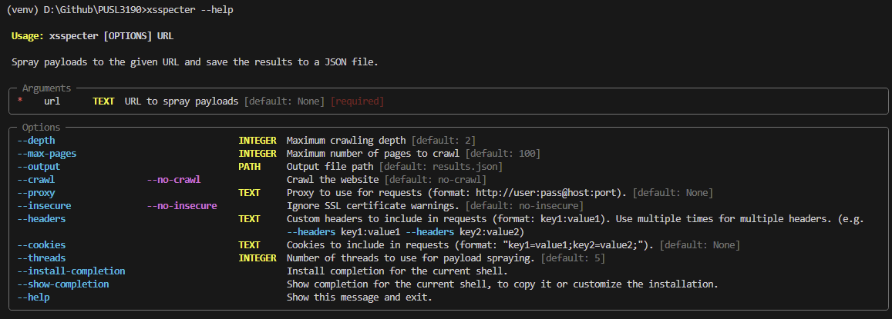
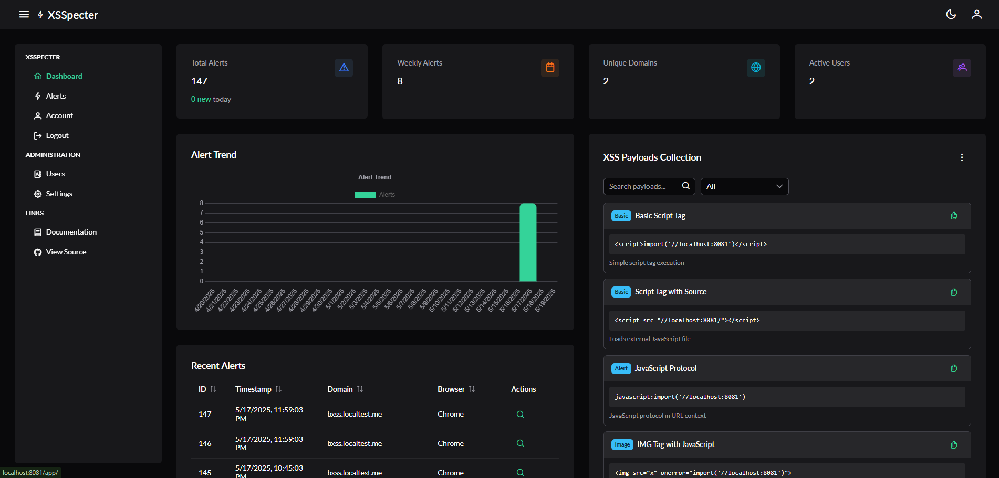
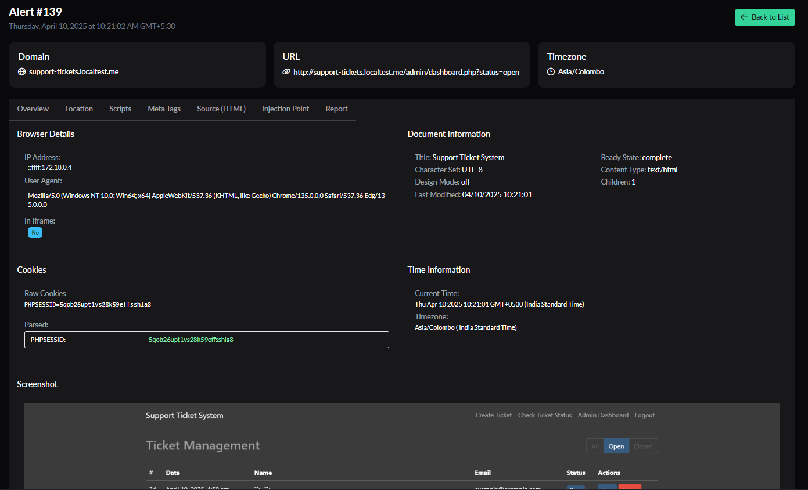
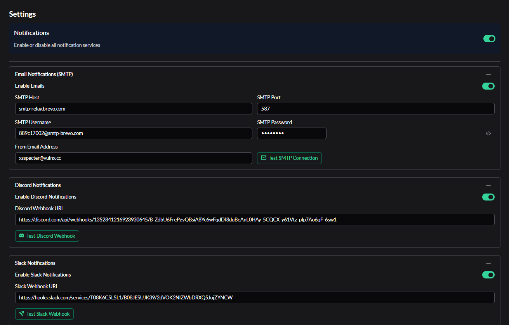

# XSSpecter

XSSpecter is a modular toolkit for managing and exploiting Blind Cross-Site Scripting (XSS) vulnerabilities. It provides two main components:

- 🔗 [Server](server/README.md) – Callback handling, data persistence, and a web dashboard.
- 💻 [CLI](cli/README.md) – XSS payload spraying automation for penetration testing.

## Ethics and Responsible Disclosure

> **⚠️ Ethics Notice:** This tool should only be used on systems and applications for which you have explicit permission to test. Unauthorized scanning or exploitation is illegal and unethical. Always adhere to applicable laws, regulations, and your organization's rules of engagement.

## Installation

- 📦 [Server Installation Guide](server/INSTALLATION.md)
- 📦 [CLI Installation Guide](cli/INSTALLATION.md)

## Documentation

- 📖 [Server Documentation](server/README.md)
- 📖 [CLI Documentation](cli/README.md)

## Project Structure

```
.
├── CLI/      # Command-line interface tool for XSS spraying
└── server/   # Backend and frontend for callback handling and dashboard
```

## Screenshots
1. CLI - Help


2. Server - Dashboard


3. Server - Alert View


4. Server - Admin Settings


## Contributing

Contributions, issues, and pull requests are welcome! Please refer to the respective component README files for contribution guidelines and licensing:

- [Server README](server/README.md)
- [CLI README](cli/README.md)

## License

This project is licensed under the MIT License. See [LICENSE](./LICENSE.txt) for details.
